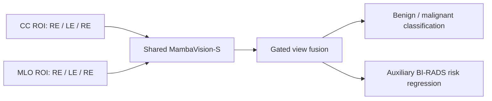

# CEM-Mamba

Dual-view multi-task learning for contrast-enhanced mammography (CEM), with benign/malignant classification and auxiliary BI-RADS risk prediction.

**Release status:** this is a cleaned research-code snapshot, not a verified reproduction of the manuscript results. The inspected server import chain uses an identity-function test stub in place of selective scan. This package makes that historical behavior explicit and uses the official scan implementation by default. Switching backends changes the computation. Read [reproducibility notes](docs/REPRODUCIBILITY.md) before using existing checkpoints or interpreting results.

[中文说明](README.zh-CN.md)

## Study overview

The manuscript describes paired CC and MLO lesion ROIs. Each view combines recombined (RE) and low-energy (LE) images as **RE–LE–RE** channels. A shared MambaVision-S backbone encodes both views, gated fusion combines their features, and two heads predict malignancy and a continuous BI-RADS target. Training combines cross-entropy and Smooth L1 losses with auxiliary-loss warm-up.



## Repository contents

| File | Purpose |
| --- | --- |
| `train_multitask_dual_view.py` | Paired-view training, regression/ordinal modes, warm-up, early stopping |
| `multitask_dual_view_model.py` | Shared backbone, view fusion, task heads |
| `multitask_dual_view_dataset.py` | Manifest loading and paired augmentation |
| `dual_view_model.py` | Backbone helpers and comparison architectures |
| `evaluate_multitask_dual_view.py` | Single-checkpoint evaluation |
| `evaluate_multitask_dual_view_cv_ensemble.py` | Mean malignancy-probability ensemble |
| `create_multitask_cv_manifests.py` | Stratified development folds with held-out splits |
| `analyze_multitask_thresholds.py` | Validation-based diagnostic threshold analysis |
| `generate_main_model_paper_heatmap.py` | Paired-view SmoothGrad saliency figures |
| `configs/` | Manuscript-oriented example and observed experimental settings |
| `scripts/` | Portable training launcher and manifest checks |
| `mambavision/` | Bundled backbone source with retained attribution |

Patient images, clinical tables, original manifests, trained weights, experiment outputs, and the manuscript itself are not distributed. Example identifiers are synthetic.

## Installation

Use Linux with an NVIDIA GPU for the official Mamba scan. The inspected server environment contains Python 3.9, PyTorch 2.8.0+cu128 and torchvision 0.23.0. This is an observed environment, not a tested installation lockfile for the official scan backend.

```bash
python -m venv .venv
source .venv/bin/activate
python -m pip install --upgrade pip setuptools wheel packaging ninja
python -m pip install torch==2.8.0 torchvision==0.23.0 --index-url https://download.pytorch.org/whl/cu128
python -m pip install -r requirements.txt
python -m pip install mamba-ssm==2.2.4 --no-build-isolation
python -c "import scan_backend; print(scan_backend.SCAN_BACKEND)"
```

The mamba-ssm version follows the original project's dependency declaration; compatibility with the observed CUDA/PyTorch environment must be verified on the target machine. Its extension build may require a matching CUDA toolkit. See the [official Mamba installation instructions](https://github.com/state-spaces/mamba/tree/v2.2.4). There is no silent fallback if the official dependency is unavailable. Optional Mammo-CLIP comparison support uses `requirements-optional.txt`.

## Prepare data

Run commands from the repository root. Prepare de-identified, paired RGB-compatible ROI images externally; this release does not convert DICOM, construct RE–LE–RE channels, or delineate lesions. Preserve the channel order in the saved images.

Use [the manifest template](examples/manifest.example.csv):

```csv
case_id,split,label,birads,cc_roi_path,mlo_roi_path,cc_path,mlo_path
synthetic_001,train,0,4A,data/images/example_cc.png,data/images/example_mlo.png,,
```

- `case_id`: unique anonymized identifier, one paired examination per row. Keep every view/examination of the same patient in one partition.
- `split`: `train`, `val`, `test`, or a cohort name passed to `--split`.
- `label`: 0 = benign, 1 = malignant.
- `birads`: `3`, `4A`, `4B`, `4C`, or `5`; required for development. Regression evaluation supports missing BI-RADS.
- Image paths: absolute paths or paths relative to the repository working directory. `roi_only` requires both ROI paths. `roi` permits full-image fallback; `full` prefers full-image columns.

The code's auxiliary targets are `{3: 0.02, 4A: 0.16, 4B: 0.54, 4C: 0.88, 5: 0.99}`. These are training targets, not calibrated clinical probabilities.

```bash
python scripts/validate_manifest.py data/manifest.csv
```

The example CSV documents the schema; its image files are intentionally absent.

## Train

```bash
python scripts/train.py --config configs/manuscript_method.json \
  --manifest data/manifest.csv --output outputs/cem_mamba \
  --pretrained-path checkpoints/backbone.pth.tar
```

Use `--pretrained` instead of `--pretrained-path` to request the backbone's upstream ImageNet weights, which may download automatically. Omitting both trains from random initialization. Load only trusted checkpoint files: experimental checkpoints use PyTorch pickle loading.

The manuscript-oriented example sets MambaVision-S, gated fusion, strong augmentation, 224-pixel inputs, batch size 16, 80 epochs, auxiliary weight 0.2, 10-epoch warm-up and patience 15. Learning rate `1e-4` and weight decay `1e-5` match the manuscript's equation text. This example is not an authenticated final experiment configuration.

`configs/observed_cv3_strongaug.json` preserves inspected run hyperparameters (25 epochs, learning rate `5e-5`, auxiliary weight 0.1, 5-epoch warm-up, patience 8). The historical initialization checkpoint and data are not included. `--dry-run` prints a command without training.

Training writes a timestamped run directory with arguments, TensorBoard logs when available, and best/final checkpoints. Select checkpoints by development validation performance, not test performance.

### Cross-validation

```bash
python create_multitask_cv_manifests.py \
  --source-manifest data/manifest.csv --output-dir artifacts/cv3 \
  --n-splits 3 --pool-splits train val --heldout-splits test --seed 20260326
```

Train one model per generated fold manifest. The manuscript is internally inconsistent: the study-design section says five folds, while the training/inference section describes three folds and a three-model ensemble. Inspected historical runs include three-fold experiments. This example follows the training/inference section; change `--n-splits` if the final protocol is corrected. It creates a new partition and does not recover the original manuscript split. Splitting is row-based and assumes unique patient-level cases; the code rejects duplicate case IDs but cannot identify the same patient under different IDs.

## Evaluate

```bash
python evaluate_multitask_dual_view.py \
  --checkpoint checkpoints/best_auc_model.pth \
  --manifest_csv data/manifest.csv --split test --view_source roi_only \
  --output_dir results/internal
```

Outputs include `evaluation_metrics.json`, `predictions.csv`, `predictions.json`, confusion matrices and a binary ROC curve. Binary classifications use 0.5 unless a separate threshold analysis is applied.

```bash
python evaluate_multitask_dual_view_cv_ensemble.py \
  --checkpoints checkpoints/fold0.pth checkpoints/fold1.pth checkpoints/fold2.pth \
  --manifest_csv data/manifest.csv --split test --view_source roi_only \
  --output_dir results/ensemble
```

Pass one checkpoint per actual fold; five-fold models require five paths. Models must share the task and label definitions. Use checkpoints trained with the selected scan backend. New training runs record backend metadata and evaluation rejects a mismatch; historical files may lack this metadata.

For validation-derived diagnostic thresholds:

```bash
python analyze_multitask_thresholds.py \
  --val-predictions results/validation/predictions.csv \
  --internal-predictions results/internal/predictions.csv \
  --output-dir results/thresholds --min-sensitivity 0.95
```

## Saliency figures

```bash
python generate_main_model_paper_heatmap.py \
  --manifest_csv data/manifest.csv --case_id YOUR_ANONYMIZED_ID --split test \
  --checkpoints checkpoints/fold0.pth checkpoints/fold1.pth checkpoints/fold2.pth \
  --view_source roi_only --output_dir results/saliency
```

This supplied script computes **SmoothGrad input saliency**, not Grad-CAM. The distinction from the manuscript's interpretability description is recorded in the reproducibility notes. Do not commit generated patient figures or predictions.

## Historical backend and verification

To inspect the original identity-scan computation, explicitly set `CEM_SCAN_BACKEND=legacy_identity` before running a command. It is retained for audit compatibility and is not a real Mamba implementation. The default is `official`; changing to it requires validating/retraining models and does not preserve historical predictions.

```bash
python -m unittest discover -s tests -v
python scripts/validate_manifest.py examples/manifest.example.csv --skip-files
python scripts/train.py --manifest examples/manifest.example.csv --dry-run
```

See [validation results](docs/VALIDATION.md) for checks actually performed and their limits.

## Attribution and license status

MambaVision source retains NVIDIA's notices and is distributed with the [NVIDIA Source Code License-NC](licenses/NVIDIA-MambaVision.txt). The adapted model registry retains its timm attribution and the [Apache 2.0 license](licenses/Apache-2.0-timm.txt). See [third-party notices](THIRD_PARTY_NOTICES.md).

No blanket MIT/Apache license is assigned to the project's own code in this snapshot; the authors have not supplied a release license. Upstream license terms continue to apply to their respective components.

For manuscript attribution, use the supplied title and author list above until the authors provide final publication metadata. Cite the [upstream MambaVision project](https://github.com/NVlabs/MambaVision) when using that backbone.
